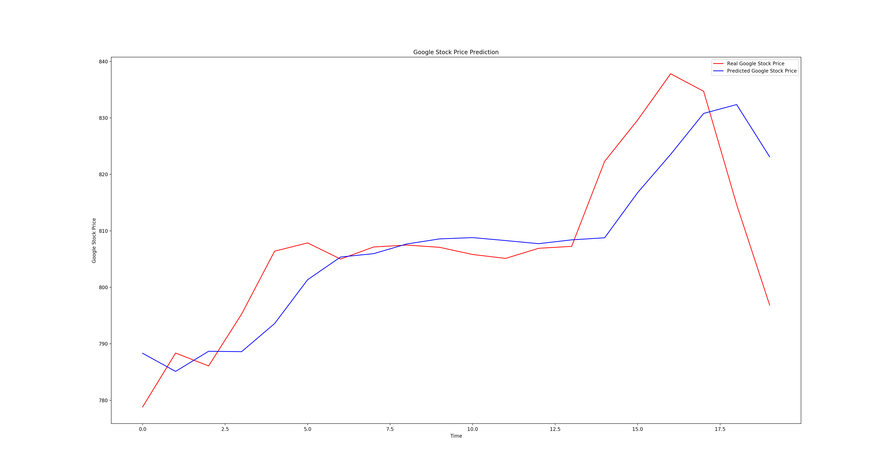
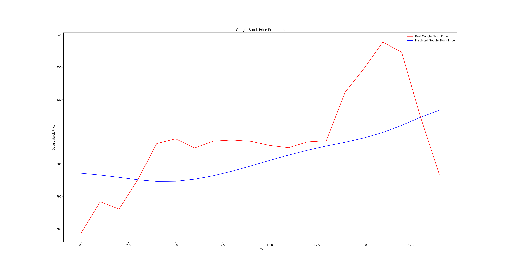
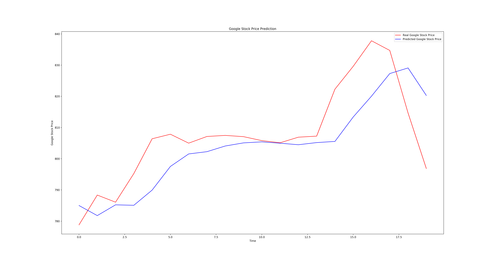
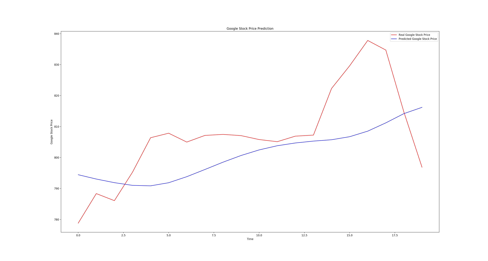

# 📈 Google Stock Price Prediction with LSTM

Predicting Google stock prices using Long Short-Term Memory (LSTM) recurrent neural networks.

## What It Does

Trains on historical Google opening stock prices (Jan 2012 – Dec 2016) and predicts January 2017 prices. The project compares multiple LSTM configurations to show how timestep window size and network depth affect prediction accuracy.

## Methodology

1. Load historical stock price CSV data
2. Normalize prices to [0, 1] using MinMaxScaler (fit on training data only)
3. Create sliding window sequences (20 or 60 timesteps → next price)
4. Train LSTM network(s) on the sequences
5. Predict test period prices using the trained model
6. Inverse-transform predictions back to real price scale

## Architecture

```
┌─────────────────────────────────────────────────┐
│                 Input Layer                      │
│          (timesteps × 1 feature)                 │
├─────────────────────────────────────────────────┤
│          LSTM Layer 1 (50 units)                 │
│              Dropout (20%)                       │
├─────────────────────────────────────────────────┤
│          LSTM Layer 2 (50 units)                 │
│              Dropout (20%)                       │
├─────────────────────────────────────────────────┤
│          LSTM Layer 3 (50 units)                 │
│              Dropout (20%)                       │
├─────────────────────────────────────────────────┤
│          LSTM Layer 4 (50 units)                 │
│              Dropout (20%)                       │
├─────────────────────────────────────────────────┤
│           Dense Output (1 unit)                  │
└─────────────────────────────────────────────────┘

Main model: 4 LSTM layers, 60 timesteps, Adam optimizer
Variants in LSTM_better_models/ explore 1 vs 4 layers, 20 vs 60 timesteps
```

## Dataset

- **Source:** Google Stock Price (Yahoo Finance)
- **Training:** 1,258 trading days (Jan 2012 – Dec 2016)
- **Test:** 20 trading days (Jan 2017)
- **Feature:** Opening price

## Project Structure

```
├── Recurrent_Neural_Networks/
│   ├── rnn.py                          # Main model (4 LSTM layers, 60 timesteps, dropout)
│   ├── Google_Stock_Price_Train.csv
│   └── Google_Stock_Price_Test.csv
├── LSTM_better_models/
│   ├── rnn_20timesteps_1lstmlayers.py
│   ├── rnn_20timesteps_4lstmlayers.py
│   ├── rnn_60timesteps_1lstmlayers.py
│   └── rnn_60timesteps_4lstmlayers.py
└── README.md
```

## Tech Stack

| | Technology | Purpose |
|---|---|---|
| 🧠 | TensorFlow / Keras | LSTM model building and training |
| 🔢 | NumPy | Numerical array operations |
| 🐼 | Pandas | CSV data loading and manipulation |
| 📊 | Matplotlib | Prediction vs actual price plots |
| ⚙️ | scikit-learn | MinMaxScaler for feature normalization |
| 🐍 | Python 3.8+ | Runtime |

## Dependencies

```
tensorflow>=2.0
numpy>=1.21
pandas>=1.3
matplotlib>=3.4
scikit-learn>=1.0
```

## How to Run

```bash
# Install dependencies
pip install tensorflow numpy pandas matplotlib scikit-learn

# Run the main model
cd Recurrent_Neural_Networks
python rnn.py

# Or try a model variant
cd LSTM_better_models
python rnn_60timesteps_4lstmlayers.py
```

Training runs for 100 epochs with batch size 32. The main model uses Adam optimizer with 50 LSTM units per layer and 20% dropout.

## Results

Comparison across model configurations (red = actual, blue = predicted):

| 20 Timesteps, 1 LSTM Layer | 20 Timesteps, 4 LSTM Layers |
|:--:|:--:|
|  |  |

| 60 Timesteps, 1 LSTM Layer | 60 Timesteps, 4 LSTM Layers |
|:--:|:--:|
|  |  |

Longer timestep windows (60 vs 20) produce smoother, more accurate predictions. Deeper networks (4 layers) capture more complex temporal patterns.

## Known Issues

- The model only uses opening price as a feature. Adding volume, high/low, and close prices could improve predictions.
- No train/validation split — all training data is used for fitting, so there's no early stopping or overfitting detection.
- Hardcoded dataset size (1258 rows) — scripts assume the exact CSV row count rather than computing it dynamically.

## License

[MIT](LICENSE) © 2018 Kaustabh Ganguly
